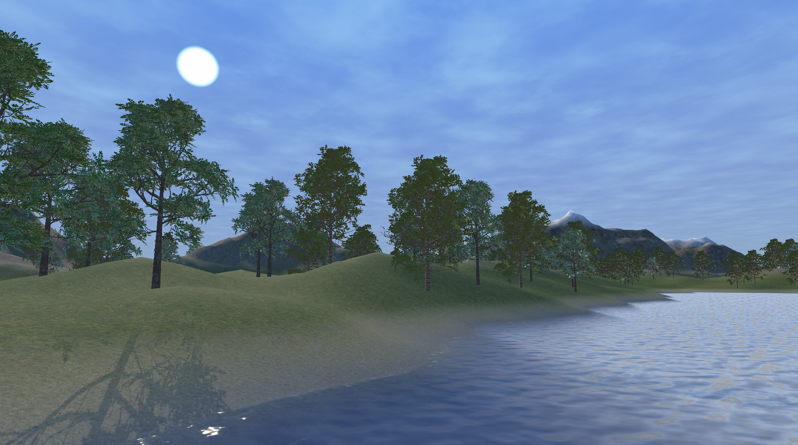
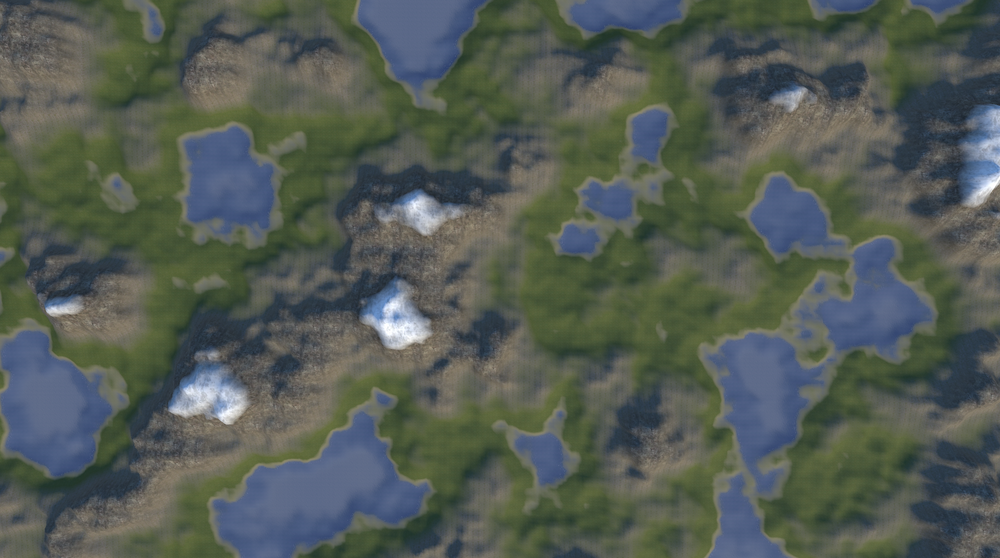
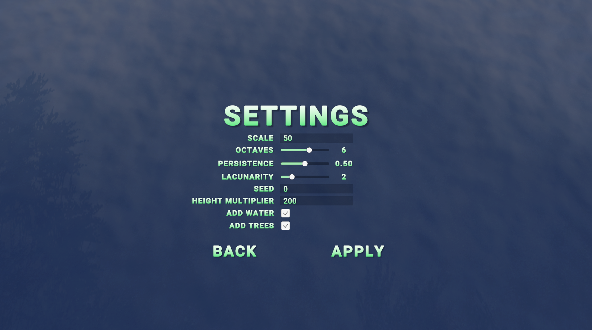
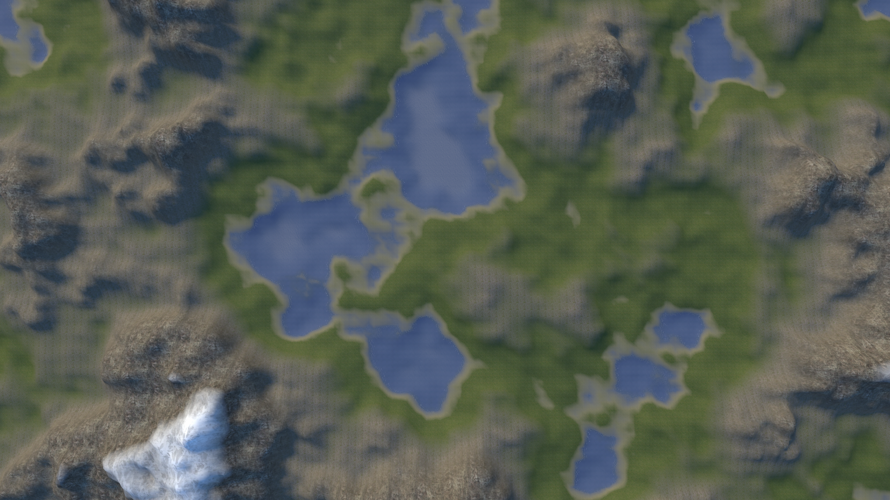
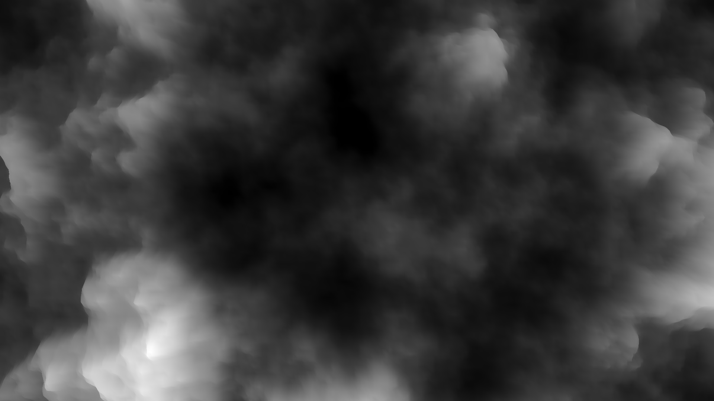
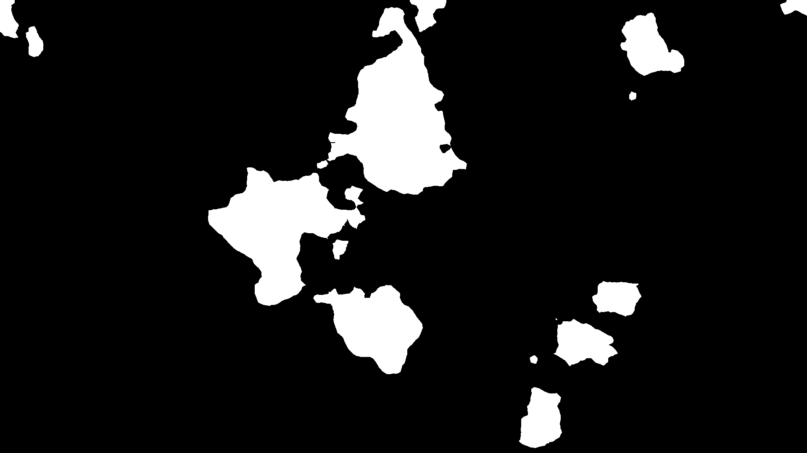

# Procedural Terrain Generation

- [English](README.md)
- [Русский](README_RUS.md)

## Screenshots

## Controls

| Keyboard & Mouse | Controls |
|:-:|:-|
| W | Move forwards |
| A | Move left |
| S | Move backwards |
| D | Move right |
| E | Move up |
| Q | Move down |
| R | Return to initial position |
| Shift | Move fast |
| Mouse Move | Rotate camera |
| Mouse Wheel | Zoom in/out |
| Esc | Enter/close menu |

## Save option

When you press `SAVE` in the menu, program will make a screenshot and save height map with water mask. You can find saved data here:

- Build: `<Path to Application Folder>\Procedural Terrain Generation_Data\TerrainData`
- Unity: `<Path to Project Folder>\Assets\TerrainData`

## Terrain data examples

| Image | Height map | Water mask |
|:-:|:-:|:-:|
|  |  | |
