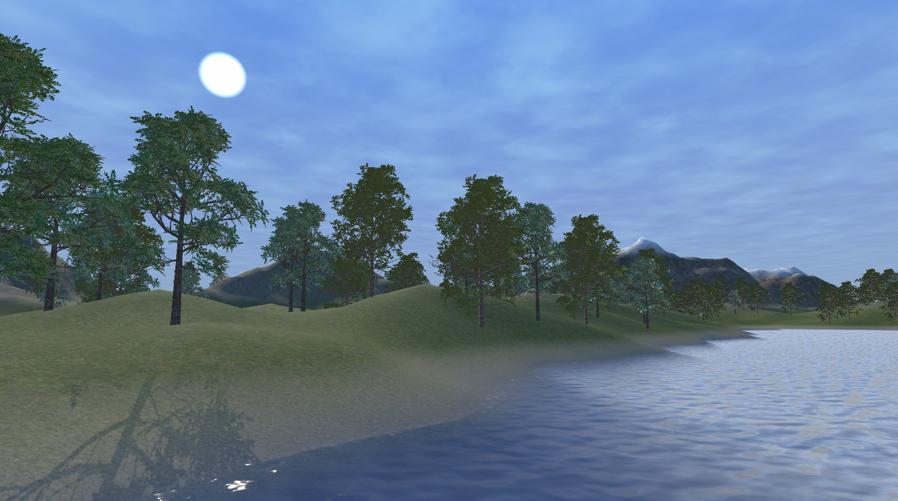

# Процедурная Генерация Ландшафта

- [English](README.md)
- [Русский](README_RUS.md)

## Управление

| Клавиатура & Мышь | Действие |
|:-:|:-|
| W | Движение вперед |
| A | Движение влево |
| S | Движение назад |
| D | Движение вправо |
| E | Движение вверх |
| Q | Движение вниз |
| R | Возвращение на изначальную позицию |
| Shift | Увеличение скорости передвижения |
| Движение Мышью | Поворот камеры |
| Колесо Мыши | Приближение/отдаление камеры |
| Esc | Открытие/закрытие меню |

## Функция сохранения

При нажатии в меню на кнопку `СОХРАНИТЬ` программа сделает скриншот и сохранит карты высот всех участков ландшафта, находящихся в области видимости камеры. Вы можете найти сохраненные данные здесь:

- Build: `<Путь до папки приложения>\Procedural Terrain Generation_Data\TerrainData`
- Unity: `<Путь до папки проекта>\Assets\TerrainData`

## Скриншоты

